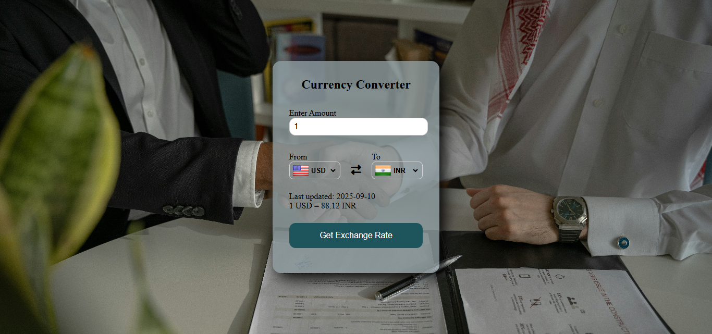

# 🌍 Currency Converter

A simple *Currency Converter* built with *HTML, CSS, and JavaScript*.  
It allows users to convert between different currencies using the *Frankfurter API* and displays country flags using *FlagsAPI*.

---

## ✨ Features
- Convert currencies in real time  
- Uses *Frankfurter API* (no API key required)  
- Default conversion: *USD → INR*  
- Displays *last updated date* from API  
- Country flags auto-updated with selection (via *FlagsAPI*)  
- Clean and responsive UI with background image  

---

## 🛠 How to Use
1. Open index.html in your browser (or use VS Code Live Server for best experience)  
2. Enter an amount  
3. Select currencies and click *Get Exchange Rate*  

---

## 🌐 Live Demo
[View Project Here](https://currency-x-converter.vercel.app/)

---

## 📸 Screenshot

---

## 🧰 Technologies Used
- *HTML5*
- *CSS3*
- *JavaScript*
- *Frankfurter API* – for exchange rates
- *FlagsAPI* – for country flags

---

✒️ Created by *Vinayak Velhal*